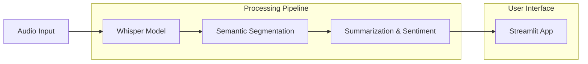

# LEXARA: Automated Podcast Transcription & Insights - Documentation Report

## 1. Project Overview

### Problem Statement
Raw audio content, such as podcasts and lectures, is unstructured and difficult to navigate. Users often struggle to find specific information without listening to the entire file. Language barriers further restrict access to valuable content for non-native speakers.

### Objectives
The primary objective of LEXARA is to transform raw audio into structured, actionable insights. Key goals include:
*   **Automated Transcription**: Converting speech to text with high accuracy.
*   **Intelligent Segmentation**: Dividing long audio into coherent, topic-based segments.
*   **Content Summarization**: Generating concise summaries and context-aware titles for each segment.
*   **Multi-Language Support**: Providing translation and romanization to make content accessible across languages.
*   **Visual Engagement**: Using 3D animations and interactive timelines to visualize podcast structure.

### Significance and Real-World Applications
*   **Education**: Helps students quickly review specific lecture topics and access content in their native language.
*   **Media & Content Creation**: Assists creators in generating show notes, chapters, and social media clips efficiently.
*   **Accessibility**: Makes audio content accessible to individuals with hearing impairments through accurate transcripts and visual cues.
*   **Research**: Enables efficient indexing and searching of large audio archives.

## 2. Dataset Description

### Source of the Dataset
The system was developed and tested using a diverse collection of audio samples representing various real-world scenarios. These samples were curated to test different genres, recording qualities, and content structures.

### Type of Audio Files
*   **Formats**: MP3 and WAV.
*   **Content Types**: Music, Political Podcasts, ambient noise (for negative testing), Educational (TED Talks), and Audiobooks.

### Podcast Samples
The testing dataset includes 5 distinct samples:
1.  **Music Track**: "I wanna be yours" (4 mins) - Tests performance with background music and lyrics.
2.  **Political Podcast**: "Broadcast-3PoliticallyPearShaped" (10 mins) - Tests multi-speaker conversational flow.
3.  **Noise Sample**: "Crowd Talking" (0 mins valid speech) - Tests edge case handling for non-speech audio.
4.  **TED Talk**: Business/Educational speech (4 mins) - Tests structured monologue.
5.  **Audiobook**: Crime genre (12 mins) - Tests narrative storytelling.

### Preprocessing Steps
*   **Format Conversion**: Automatic handling of input formats using `ffmpeg` to ensure compatibility with the transcription model.
*   **Noise Filtering**: Implicit noise suppression via the Whisper model's robust architecture.
*   **Input Sanitization**: Verification of file types and sizes before processing to ensure system stability.

## 3. System Architecture

The LEXARA system follows a linear pipeline architecture, transforming raw audio into an interactive web interface.

**Stage Explanations:**
1.  **Audio Input**: User uploads an MP3/WAV file via the Streamlit interface.
2.  **Preprocessing & Transcription**: The `openai-whisper` model (Small, 244M params) processes the audio to generate a timestamped transcript. It handles language detection automatically.
3.  **Topic Segmentation**: The transcript is split into sentences, embedded into vector space, and grouped into coherent topics based on semantic similarity using Cosine Similarity.
4.  **Content Analysis**:
    *   **Summarization**: `google/flan-t5-base` generates abstractive summaries.
    *   **Title Generation**: Extracting context-aware titles for each segment.
    *   **Sentiment Analysis**: Determining the emotional tone of each segment.
5.  **Visualization & UI**: The processed data is rendered into an interactive timeline, 3D animation (Three.js), and keyword word clouds.

## 4. Tools and Libraries Used

### Audio Processing & Transcription
*   **`openai-whisper`**: Chosen for its state-of-the-art accuracy in speech-to-text, robust handling of accents, and multi-language support.
*   **`ffmpeg-python`**: Used for efficient audio format handling and backend processing.

### NLP & Analysis
*   **`sentence-transformers`**: Used to generate semantic embeddings for topic segmentation, allowing the system to understand context beyond simple keyword matching.
*   **`transformers` (Hugging Face)**: Specifically `google/flan-t5-base` for generating high-quality abstractive summaries and titles.
*   **`textblob`**: A lightweight library used for efficient sentiment polarity analysis.
*   **`deep-translator` & `indic-transliteration`**: Enables multi-language support and romanization for accessibility.

### Visualization
*   **`matplotlib`**: Used to generate the custom, rigorous interactive timeline bar graphs.
*   **`wordcloud`**: Generates visual representations of key terms for each topic.
*   **Three.js (via HTML)**: Powers the 3D animation layer to visualize topic flow and structure.

### User Interface
*   **`streamltt`**: Selected for rapid development of data-centric web applications, allowing for easy integration of Python backend logic with a reactive frontend.

## 5. Implementation Details

### Transcription
Transcription is performed using the **Whisper Small model**. The audio is processed in 30-second windows. The system automatically detects the source language but allows manual override for challenging audio (e.g., songs) to ensure accuracy. The output includes precise timestamps for every text segment.

### Topic Segmentation
Segmentation uses a **semantic similarity approach**:
1.  **Sentence Splitting**: The transcript is divided into sentences.
2.  **Embedding**: Each sentence is converted into a vector using the `all-MiniLM-L6-v2` model.
3.  **Clustering**: Consecutive sentences are compared using Cosine Similarity. If the similarity drops below a threshold (0.82), a new topic boundary is marked.
4.  **Refinement**: Short segments are merged, and constraints (min/max sentences) are applied to ensure readability.

### Summarization & Title Generation
Abstractive summarization is implemented using the **Flan-T5 model**.
*   **Summaries**: The model is prompted to "Summarize this in one sentence," focusing on key information points extracted from the text.
*   **Titles**: A separate prompt ("What is this text about? Summarize in 5-7 words") generates context-aware, human-readable titles (approx. 8-10 words) rather than generic labels.

### Sentiment Analysis
Sentiment is calculated using **TextBlob**. The polarity score (ranging from -1.0 to 1.0) is mapped to a 1-10 scale for user-friendly display.
*   **Positive**: Polarity > 0.1 (Green)
*   **Negative**: Polarity < -0.1 (Red)
*   **Neutral**: Between -0.1 and 0.1 (Orange)

### Interactive Timeline & Keyword Cloud
*   **Timeline**: A responsive Matplotlib figure visualizes the duration of each topic. It uses color-coding to distinguish segments and provides a visual map of the entire episode.
*   **Keyword Cloud**: Key concepts are extracted based on word frequency and position. These are rendered into a Word Cloud image where font size correlates with the term's importance (frequency weight).

## 6. Results and Outputs

### Full Transcript
The system provides a complete, timestamped transcript of the audio, broken down by identified topics. Users can read the text sequentially or jump to specific sections.

*[Insert Screenshot of the Transcript View here]*

### Topic Segments
The audio is divided into distinct cards, each displaying:
*   **Topic Title**: E.g., "Introduction to Virtual Assistant Opportunities"
*   **Summary**: A concise overview of the segment.
*   **Duration**: Precise start and end times.

*[Insert Screenshot of Topic Cards here]*

### Interactive Timeline
A horizontal bar chart displays the entire audio file's structure at a glance. Each colored block represents a topic, with its length proportional to the duration.

*[Insert Screenshot of Matplotlib Interactive Timeline here]*

### Keyword Cloud
For each topic, a visual word cloud highlights the most significant terms, helping users quickly grasp the core themes.

*[Insert Screenshot of Word Cloud generation here]*

### User Interface
The Streamlit-based UI integrates all these elements into a clean, dark-mode dashboard with "Upload," "Process," and "Insights" sections.

*[Insert Screenshot of the main Dashboard here]*

## 7. Testing and Feedback (Week 6 Summary)

The system underwent rigorous testing with 5 diverse test cases.

| Podcast Name | Genre | Duration | Outcome | Score |
| :--- | :--- | :--- | :--- | :--- |
| **I wanna be yours** | Music | 4 mins | Accurate lyrics, 2 segments found. Localization/Translation working. | 9/10 |
| **Broadcast-3** | Political | 10 mins | Perfect segmentation (10 topics). Excellent keyword extraction. | 10/10 |
| **Crowd Talking** | Noise | 0 mins | "No topics found" (Correct handling of noise edge case). | N/A |
| **TED Talk** | Business | 4 mins | 3 distinct topics identified. Summaries were precise. | 9/10 |
| **Audio Book** | Crime | 12 mins | 10 detailed segments. Rich narrative capture. | 10/10 |

**User Feedback & Improvements:**
*   **Contrast Issues**: Users reported readability issues with initial color schemes. **Action**: Implemented high-contrast "Dark Box" styling with white text.
*   **Generic Titles**: Initial titles were vague. **Action**: Integrated LLM-based context-aware title generation.
*   **Noise Handling**: System initially tried to transcribe noise. **Action**: Implemented validation to gracefully handle non-speech audio.

## 8. Limitations

*   **Transcription Inaccuracies**: While Whisper is robust, it may still struggle with very heavy accents or overlapping speech (diarization is currently limited).
*   **Imperfect Segmentation**: Semantic boundaries are subjective; the system may occasionally split a coherent topic or merge distinct ones if the vocabulary overlap is high.
*   **Dependence on Audio Quality**: Poor quality recordings with high background noise can degrade transcription and subsequent analysis accuracy.
*   **Resource Intensity**: Large files (>1 hour) require significant processing time and memory, which may limit local deployment on lower-end machines.

## 9. Future Work

*   **Speaker Identification**: Implementing "Diarization" to distinguish between different speakers (e.g., "Speaker A", "Speaker B").
*   **Real-time Transcription**: shifting from batch processing to a streaming architecture for live audio analysis.
*   **Advanced User Interface**: Developing a dedicated frontend (React/Vue) to replace Streamlit for finer control over animations and interactivity.
*   **Custom Vocabulary**: Allowing users to upload a glossary of terms (e.g., technical jargon, names) to improve transcription accuracy for specialized domains.
*   **Cloud Deployment**: Optimizing the pipeline for serverless deployment (e.g., AWS Lambda, Google Cloud Run) to handle concurrent users and larger files.
